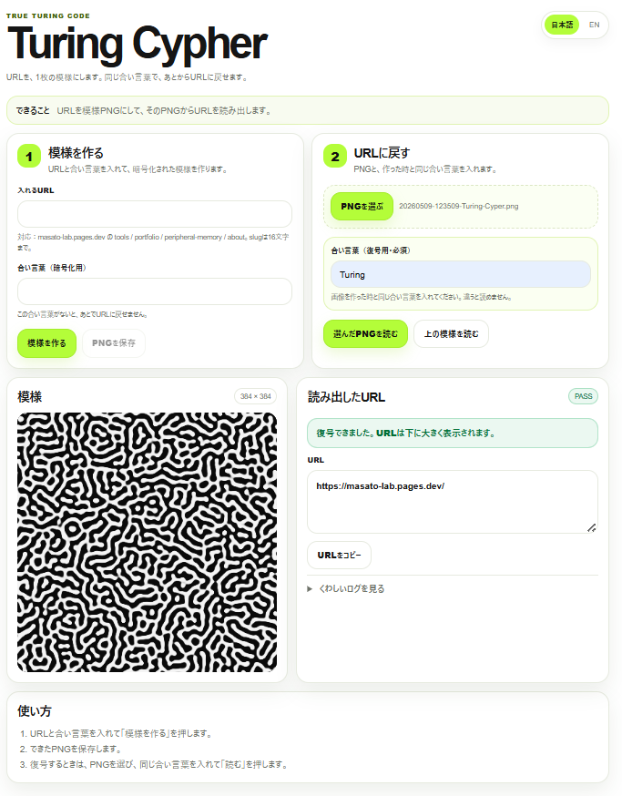

# Turing Cypher

**Turing Cypher** は、URLを1枚の Gray-Scott / reaction-diffusion 模様PNGに変換し、同じ合い言葉でURLへ戻せるPWAです。

生成されたPNGは、ただの装飾画像ではなく、復号用の情報を持った1枚の模様として扱います。

## 実行ページ

https://turing-cypher.pages.dev/

## Screenshot

<p align="center">
  
</p>

## Features

- URLを1枚の模様PNGに変換
- PNGと同じ合い言葉からURLを復号
- 復号結果を大きく表示
- PNG保存名は `YYYYMMDD-HHMMSS-Turing-Cyper.png`
- 日本語 / English 切り替え
- PWA対応
- 白背景 + 黄緑アクセントのシンプルUI

## How to use

1. **模様を作る**  
   URLと合い言葉を入力して、「模様を作る」を押します。

2. **PNGを保存**  
   生成された模様をPNGとして保存します。

3. **URLに戻す**  
   保存したPNGを選び、作成時と同じ合い言葉を入力して読み出します。

## Concept

Information is not attached to the image.  
It inhabits the generative conditions from which the organic form emerges.

Turing Cypher は、QRコードやバーコードのような明示的な記号ではなく、反応拡散によって生まれる有機的な形の中に情報を宿す実験です。

## Deploy

Cloudflare Pages にデプロイする場合:

```powershell
cd "$env:USERPROFILE\Desktop\Turing_Cypher"
npx wrangler pages deploy . --project-name turing-cypher
```

デプロイ後:

```text
https://turing-cypher.pages.dev/
```

PWAキャッシュが残る場合は、クエリ付きで確認します。

```text
https://turing-cypher.pages.dev/?v=turing-clean-text-1
```

## Files

```text
index.html
style.css
app.js
manifest.webmanifest
sw.js
icon-192.png
icon-512.png
screenshot1.png
README.md
```

## Tags

`#PWA` `#TuringCypher` `#ReactionDiffusion` `#GrayScott` `#VibeCoding`
